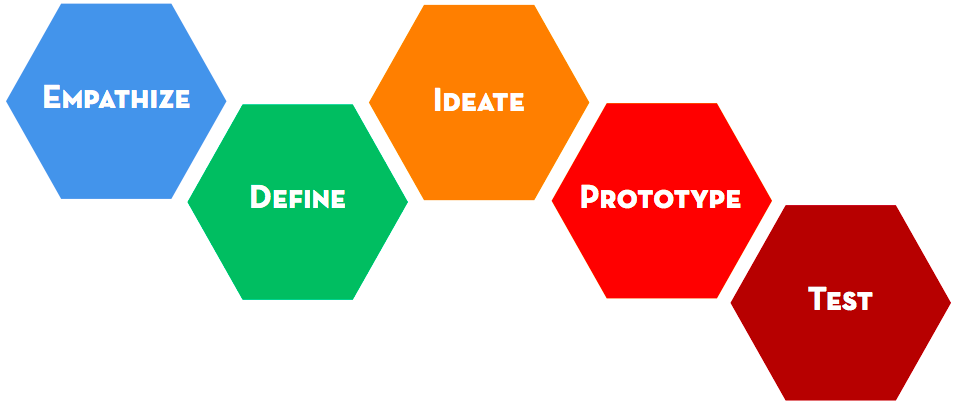

1. You've decided that you want to do a project. Yay! That's exciting. 

 But just how do you get started? It can seem like a daunting task, but don't worry, you've got this. The trick is to break it up into little pieces and start small. 
 
 These cards will take you through the process of **designing** something from start to finish. They are based on the **Design Thinking Process** taught at the Stanford d.school.

2. The design process is made up of five steps:
 * **Empathise**
 
   Put yourself in the shoes of the person or people who will use your project and try to understand their point of view.
 * **Define**
 
 Figure out what problem needs solving.
 * **Ideate**
 
 Sketch out as many ideas as you can for how you could go about solving the problem.
 * **Prototype**
 
 Put one or more of your ideas into action and build something. It doesn't have to be perfect first time!
 * **Test**
 
 Try out your prototype to see what can be improved upon. Keep prototyping and testing until you have a finished product you are happy with!

 
 Image: Modes/Mindsets Handout by Stanford University d.school \([CC BY-NC-SA 4.0](https://creativecommons.org/licenses/by-nc-sa/4.0/)\) 
 
 It is an **iterative** process. That means you repeat parts of it, or even repeat the whole process, maybe lots of times before you are finished.
 
1. # Empathise
 The first step is to consider who you are making the project for. That will the **user** or **users**. Is it yourself? Your friends? A particular group of people, for example, school kids of a certain age, parents, people with a disability or difficulty of some sort?
 
 Whoever your **user** is, the aim of this step is to **understand** them. The best way to do this is by asking them questions.
 
 Get them to tell you about their experiences with the activity your are interested in. Ask questions such as
 * When was the last time they did the activity?
 * What was their favourite part?
 * What was their least favourite part?
 * Why?
 
 Dig deeper by asking "Why?" often.
 
 Find out what's important to them. Don't just focus on facts, but look for stories and feelings. You are trying to put yourself in their shoes so that you can understand **what they need or want**.
 
 Make sure you have a pen and paper ready when you talk to your user. Write down lots of notes, keeping track of all the little details. 

