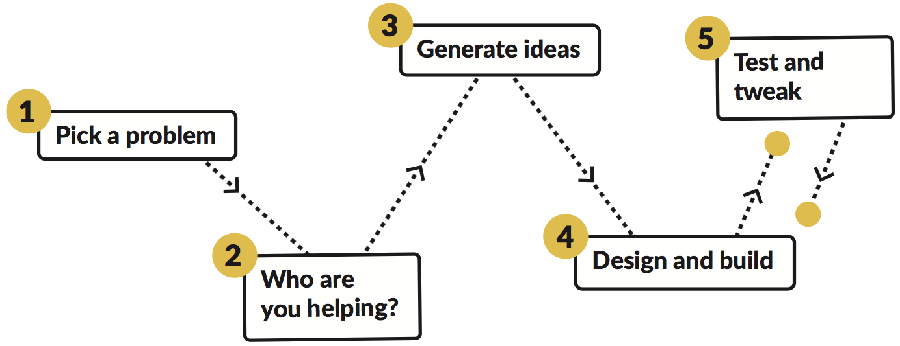

1. You've decided that you want to do a project. Yay! That's exciting. 

 But just how do you get started? It can seem like a daunting task, but don't worry, you've got this. The trick is to break the project down into little pieces and start small. 

 These Meta Sushi cards will take you through the process of designing and building your technology project from start to finish. There are five main steps you will carry out:

 

 ### **Pick a problem**

 How do you want to change the world with technology? Look up how other people have solved similar issues.
    
 ### **Who are you helping?**
 
 Think about what kinds of people your project will help and how it will work best for them. How can you adapt what you're building to their needs?

 ### **Generate ideas**
 
 Collect ideas, no matter how wacky, for how your project might work. Pick your favourite!

 ### **Design and build**
 
 Draw some designs for the idea you picked, then start making it! Remember: your Dojo's Mentors can help if you have trouble.
 
 ### **Test and tweak**
 
 As soon as some of the project works, get people to try it! Ask them what aspects of it you could make better or more useful. Tweak your project, and test it again.
 
 This cycle of testing and tweaking is an **iterative** process. That means you repeat parts of it, maybe lots of times, before you are finished.
 
2. Breaking the process down like this is a trick commonly used for lots of different types of projects, not just technology ones. For example, when someone wants to build a house, they will break that project down into pieces:
 - They might first decide what kind of house to build
 - Then they draw up plans for what it should look like
 - Next, they'll work out how they will build it based on the plans
 - Finally, they gather the materials (and maybe builders!) needed and then do the building work
 

