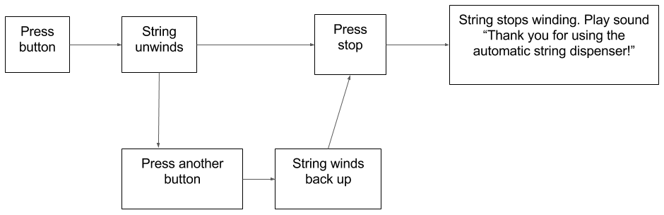

1. # Pick a problem

 The first step is to **define** the purpose of your project.

 ## Who will you be making it for?
 The person or people who will use your project are called your **user** or **users**. It could be a specific person or group of people, such as a friend or relative, a teacher, the people in your Dojo or school, or even you yourself. The user doesn't have to be someone you know: it could also be a more general group of people, for example, school kids of a certain age, parents, people with a disability or difficulty of some sort, or people who like cats!

 ## What problem will it solve?
 What do you want to help them with? Why do you want to help them? Maybe your neighbour has a dog that keeps getting lost and you want to help them keep track of it. Perhaps you want to help people to prepare for school or hospital, or learn more about the environment. Or maybe you want to help somebody to have fun!

 ## Has it been done before?
 Do some research to find out if anybody done something similar to your project before or tried to solve a similar problem. 
 
 Define a <b>problem statement</b> by writing down specifically what you want to achieve. Your project will be much more useful if you have a clear idea of what you want it to do and why before you start.

2. # Who are you helping?

 In this step you will try to gain **empathy** for the person or people you are making the project for. That means to put yourself in their shoes and **understand** their needs. 

 A great way to **empathise** with your user is by asking questions. Get them to tell you about their experiences with the thing you are helping them with. **Investigate** ways in which your project could help them. Keep asking "Why?" to get as much detail as you can! Be sure to listen carefully to their answers. Write down lots of notes, keeping track of all the little details. Or, you could even ask their permission to take a recording of the conversation.

 It's ok if you have some ideas already about what they might say, but make sure you ask questions to test whether your **assumptions** are correct! Find out what's important to them. You are trying to see things from their point of view so you that you can understand **what they need or want**.

  * If you you can't talk to your user directly, you might make **observations** based on stuff you've read or something you've seen on TV.

 Another thing to think about is whether your user is comfortable with technology! Will they be able to use your project or will they need help?
 
 This step is all about <b>caring</b> for your user and considering what your they need or want. After all, they are the person who will be using your project!
 

3. # Generate ideas
 ## What will you make?
 With a purpose defined for your project, you can now get the creative juices flowing and start **brainstorming ideas** for how you could solve the problem you picked. Pens and pencils at the ready... and lots of paper! 
 
 No writing here: sketch out your ideas with **pictures** instead of words. Don't worry about your drawing skills. Since the aim is to describe **ideas** and not create a work of art, stick figures and squiggly lines are perfect!
 
 Make sure you put down every idea that pops into your head: you are going for **quantity**, not **quality**. Let your imagination run wild. Who cares if an idea is good or bad? You can think about that later. Right now you just want to get everything out of your head and onto that paper.  
  * If you only have one or two ideas, that's ok too! The important thing is to get them on paper.

 ## How will you make it?
 After you've sketched out your ideas, you can look at them and think about which ones you like. Pick your favourite idea and then start jotting down some ideas on how you might make that idea a reality.

 List some of the things you want your project to do, as well as some of the things it won't do. Decide what technology you will use: for example will it be a mobile phone app, or perhaps a Scratch project, or something else?
 
  Not every idea has to be amazing. In fact, for almost every brilliant invention, the chances are someone had a tonne of silly ideas too that turned out to be terrible! That's how brainstorming works. 

4. # Design and build
 Before you jump right in and start coding or constructing circuits, it's a good idea to plan out how it will work and how it should look, so that you what you need to do. 

 Work out what **information** you'll need, if any. That could be information your project presents to the user, or answers the user needs to **input** when using the project, for example by selecting different buttons or options, or by entering text. How will you use the information in your project?

 Try to draw out a **flow chart** showing how the project will work, or how a person will interact with it, step by step. This will help you to decide how different parts of your project should be organised or connected. What is the first thing that the user will see? What will happen when they start using it? Will they click on something? Will your project use feedback to tell the user things, such as sounds, flashing lights or messages? What happens when the person is finished using it?

 For example, the **flow** chart for an automatic string dispenser might look like this: 

 Then sketch out what your project will look like in action. 
 
 If you're making a software project, such as an app, a website, or something in Scratch, draw out the screens you'll create, or some possible layouts of a page. Will your user need to **navigate** \(find their way around different screens\), and if so, how will they do that? For example, maybe you'll have a **navigation** menu or things that the user will click or swipe, or perhaps the person will press keys on their keyboard or even use voice commands.
 
 For a hardware project, draw sketches of any parts you'll be building and circuits you need to make. Are you designing a robot? What will it look like? 
 
 Finally comes the part where you actually make something! Based on your designs, create the first **prototype** of your project.
  * A **prototype** is an early version that is made for testing out an idea
 
 You don't have to make the whole project at this stage. You might only make one tiny part of it or a simple example for now. For example, if you are making an animation, or an app, you might just do one screen that does one little thing. The idea is to do just enough to test it out and see if you are on the right track.

 It would be an awful shame if you spent a lot of time developing a whole project and found out after you were done that it wasn't right. By building your project bit by bit, testing it as you go along, you find out early on if you need to change something. 

5. # Test and tweak
 Once you have a working prototype, get a user to **try it out**, or try it yourself. 
 
 The aim of testing is to get **feedback**: opinions and suggestions. Are you on the right track with the project? Is it doing what it is supposed to do? So far maybe it only does a part of it's job, in that case does it do that correctly? Does it look how you want it to look? 
 
 Is the person using your project the way you expected them to? If not, why not? What can you change?
 
 If the person testing your project has problems or gets stuck, don't help them straight away. You won't be there to explain things every time someone uses your project. Instead, make a note of it – that could be a place where you can make improvements!

 Try to write down answers to some of the questions above and anything else you learned from the test. Then plan what you need to do next. If you go back and do more building, be sure to test again afterwards!

 ## Iterate!
 Keep doing a small chunk of work at a time and testing again, for example add a new screen or button, work on a bit of movement or sound, whatever makes up your project. This is called **iterating**. Gradually you will build up all the pieces and end up with a finished product. Test out the finished product too! Keep making changes and testing again until you and your user are satisfied. 
 * Coders and designers all over the world work like this too. Many of the applications you use probably went through lots of **iterations** before they were done. In fact, many projects are never fully complete! Think about applications or websites that you've seen: they sometimes get updates, right? Each update is the result of another **iteration** of testing and building.

  Remember, the user is the person you are making this project for. Don't be upset if they don't like something. All feedback is good feedback because it helps you to come up with the best possible solution. 

 